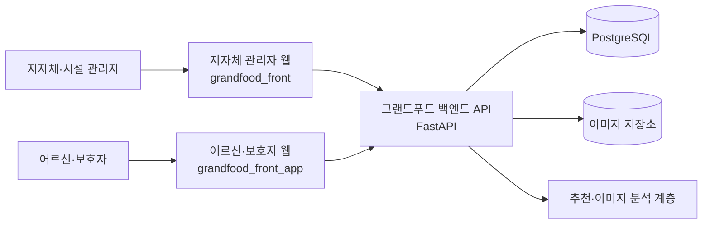

# 그랜드푸드 지자체 관리자 웹

그랜드푸드(GrandFood)의 **지자체·돌봄시설 관리자용 웹 서비스**입니다. 지자체 담당자와 시설 영양사가 대상자의 식사·건강 정보를 관리하고, 월간 반찬 추천을 검수하며, 지역 및 시설 단위 현황을 모니터링할 수 있도록 구성되어 있습니다.

> 이 저장소는 어르신·보호자용 서비스(`grandfood_front_app`)와 별도로 운영되는 **지자체 관리자 웹(GOV)**입니다. 두 웹 서비스는 그랜드푸드 백엔드 API를 공통으로 사용합니다.

## 주요 기능

### 인증 및 권한 관리

- 관리자 로그인 및 로그아웃
- `sessionStorage` 기반 관리자 세션 유지(프론트엔드 기본 만료 1시간)
- 역할별 메뉴 및 페이지 접근 제어
- 담당자 가입 신청, 승인 및 계정 관리
- 로그인 기록 및 개인정보 열람 기록 조회(최종관리자)

### 대상자 관리

- 관할 대상자 목록 조회, 검색, 필터링 및 CSV 내보내기
- 대상자 신규 등록과 기본·건강 정보 수정
- 질환, 알레르기, 활동량, 거동 상태, 저작 상태 등 건강 프로필 관리
- 최근 식사 기록과 영양 섭취 추이 확인

### 월간 반찬 추천 및 영양사 검수

- 대상자별 월간 추천 캘린더 조회
- 월간 추천 생성·강제 재생성 및 작업 상태 폴링
- 날짜·끼니별 추천 메뉴 상세 조회
- 검수 대기(`pending`), 승인(`confirmed`), 반려(`rejected`) 상태 관리
- 추천 반찬 교체 및 검수 의견 관리

월 경계에 걸친 첫째 주도 빠짐없이 표시하기 위해 캘린더는 API 응답의 `weeks`가 아니라 `days`를 기준으로 날짜 셀을 구성합니다. 따라서 해당 월 1일이 월요일이 아니더라도 1일부터 모든 날짜를 표시할 수 있습니다.

### 식사 이미지 및 잔반 분석

- 식사 전·후 이미지 업로드
- 이미지 형식 및 최대 용량(10MB) 검증
- HEIC/HEIF 이미지의 JPEG 변환
- 분석 작업 상태 폴링 및 결과 표시
- 섭취량과 부족 영양소 확인

### 통합 모니터링

- 지자체·시설·대상자 단위 현황 요약
- 시·도에서 시·군·구로 이어지는 지도 모니터링
- GeoJSON 기반 지도 렌더링
- 개별 API 실패 시 조회 가능한 데이터부터 표시하는 부분 실패 처리
- 실제 데이터 화면과 발표·시연용 예시 화면 분리

### 공지 및 운영 관리

- 로그인 후 공지사항을 첫 화면으로 제공
- 공지사항 조회 및 권한에 따른 관리
- 지자체, 산하시설 및 담당자 등록 관리

## 사용자 권한

| 권한 코드 | 사용자 | 주요 범위 |
| --- | --- | --- |
| `SUPER_ADMIN` | GrandFood 최종관리자 | 전체 기관·계정 관리, 가입 승인, 접근 기록, 전체 모니터링 |
| `MUNICIPALITY_ADMIN` | 지자체 관리자 | 관할 시설·담당자 관리, 대상자 및 지도 모니터링 |
| `MUNICIPALITY_STAFF` | 지자체 담당자 | 관할 대상자 조회 및 업무 기능 사용 |
| `CARE_FACILITY_ADMIN` | 돌봄시설 관리자 | 소속 시설의 대상자 및 식사 정보 관리 |
| `CARE_FACILITY_NUTRITIONIST` | 시설 영양사 | 소속 시설 대상자의 반찬 추천 검수 및 식사 관리 |

웹 화면의 접근 제어는 사용자 경험을 위한 1차 방어선입니다. 데이터 보안을 위한 최종 인증·인가는 백엔드 API에서도 반드시 검증해야 합니다.

## 기술 스택

| 구분 | 기술 |
| --- | --- |
| 웹 프레임워크 | Next.js 16 (App Router) |
| 화면 개발 | React 19, TypeScript 5 |
| 디자인·스타일 | Tailwind CSS 4, shadcn/ui, Base UI |
| 아이콘·알림 | Lucide React, Sonner |
| 이미지 처리 | heic2any |
| 코드 품질 검사 | ESLint |
| 배포 설정 | Vercel (`vercel.json`) |

## 시스템 구성



추천 생성이나 이미지 분석처럼 즉시 완료되지 않는 작업은 작업 상태를 주기적으로 확인한 뒤 결과를 갱신합니다.

## 디렉터리 구조

```text
grandfood_front/
├─ public/                       # 정적 이미지, 지도 데이터 등
├─ src/
│  ├─ app/admin/                # 관리자 페이지와 라우트
│  │  ├─ login/                 # 로그인
│  │  └─ (dashboard)/           # 인증이 필요한 화면
│  ├─ components/
│  │  ├─ admin/                 # 관리자 도메인 컴포넌트
│  │  ├─ brand/                 # 브랜드 컴포넌트
│  │  └─ ui/                    # 공통 UI 컴포넌트
│  ├─ hooks/                    # 공통 React 훅
│  └─ lib/                      # API 통신, 타입, 인증, 데이터 변환
├─ FRONTEND_API_SPEC.md         # 프론트엔드 관점 API 명세
├─ package.json
└─ vercel.json
```

## 주요 라우트

| 경로 | 화면 | 비고 |
| --- | --- | --- |
| `/admin/login` | 관리자 로그인 | 성공 후 공지사항으로 이동 |
| `/admin/notices` | 공지사항 | 기본 진입 화면 |
| `/admin/residents` | 대상자 명단 | 검색, 필터, 등록, CSV 내보내기 |
| `/admin/residents/[id]` | 대상자 상세 | 건강 프로필, 식사 기록, 추천 및 검수 |
| `/admin/statistics-empty` | 통합 모니터링 | 실제 API 데이터 중심 화면 |
| `/admin/statistics-empty/map` | 지도 모니터링 | 권한 제한 적용 |
| `/admin/statistics-empty/facility` | 시설 현황 | 시설 단위 조회 |
| `/admin/statistics` | 통합 모니터링(예시) | 발표·시연용 데이터 포함 |
| `/admin/statistics/map` | 지도 모니터링(예시) | 발표·시연용 화면 |
| `/admin/statistics/facilities/[id]` | 시설 상세(예시) | 예시 시설 데이터 사용 |
| `/admin/dashboard` | 운영 관리 | 기관, 시설, 담당자 등록·승인 |
| `/admin/access-logs/logins` | 로그인 기록 | `SUPER_ADMIN` 전용 |
| `/admin/access-logs/views` | 개인정보 열람 기록 | `SUPER_ADMIN` 전용 |

`/admin`으로 직접 접근하면 로그인 페이지로 이동합니다. 인증이 필요한 화면은 공통 관리자 레이아웃과 `AdminAuthGuard`의 보호를 받습니다.

## 로컬 실행

### 요구 사항

- Node.js 20 이상 권장
- npm
- 실행 중인 그랜드푸드 백엔드 API

### 설치

```bash
git clone <repository-url>
cd grandfood_front
npm install
```

### 환경 변수

프로젝트 루트에 `.env.local` 파일을 생성합니다.

```dotenv
NEXT_PUBLIC_API_URL=http://localhost:8000
```

| 변수 | 필수 여부 | 설명 |
| --- | --- | --- |
| `NEXT_PUBLIC_API_URL` | 배포 환경 필수 | 그랜드푸드 백엔드 API의 기준 주소 |

개발 환경에서는 값이 없을 때 로컬 API 주소를 사용할 수 있지만, 배포 환경에서는 누락 시 오류가 발생하므로 반드시 설정해야 합니다. `NEXT_PUBLIC_` 변수는 브라우저 번들에 포함되므로 비밀키나 민감한 값은 저장하지 마세요.

### 개발 서버

```bash
npm run dev
```

브라우저에서 [http://localhost:3000/admin/login](http://localhost:3000/admin/login)에 접속합니다.

## 명령어

| 명령어 | 설명 |
| --- | --- |
| `npm run dev` | 개발 서버 실행 |
| `npm run build` | 프로덕션 빌드 생성 |
| `npm run start` | 프로덕션 빌드 실행 |
| `npm run lint` | ESLint 검사 |
| `npx tsc --noEmit` | TypeScript 타입 검사 |

현재 별도의 자동화 테스트 명령은 등록되어 있지 않습니다. 변경 반영 전 최소한 lint, 타입 검사, 프로덕션 빌드를 확인하는 것을 권장합니다.

## 인증 및 API 통신

- 로그인 API: `POST /auth/staff/login`
- 관리자 정보와 액세스 토큰은 `sessionStorage`의 `grandfood_admin_session` 키에 저장됩니다.
- 공통 API 통신 모듈이 토큰을 `Authorization: Bearer <token>` 헤더로 전달합니다.
- 세션 정보가 없거나 유효하지 않으면 `/admin/login`으로 이동합니다.
- 권한이 부족한 페이지에 접근하면 허용된 기본 페이지로 이동합니다.
- 네트워크 실패와 API 오류는 사용자가 이해할 수 있는 메시지로 변환해 표시합니다.

API 계약과 엔드포인트 상세는 [`FRONTEND_API_SPEC.md`](./FRONTEND_API_SPEC.md)를 참고하세요. 백엔드 변경 시 프론트엔드 타입과 이 문서를 함께 갱신해야 합니다.

## 핵심 구현 참고사항

### 월간 추천 캘린더

월간 추천 응답의 `weeks`는 해당 월 소속의 주별 추천 카드이고, `days`는 해당 월의 날짜별 캘린더 데이터입니다. 달의 첫날이 월요일이 아니면 첫째 주 시작일은 이전 달에 속할 수 있으므로 캘린더는 반드시 `days`를 순회하고 현재 월 날짜만 필터링·정렬해야 합니다.

### 이미지 분석

업로드 전 형식과 크기를 검사하고 HEIC/HEIF 파일은 JPEG로 변환합니다. 업로드 후 분석이 비동기로 처리되므로 완료 또는 실패 상태가 반환될 때까지 작업 상태를 조회합니다.

### 지도 모니터링

지도는 GeoJSON 데이터를 이용해 SVG로 렌더링하며 시·도 선택 후 시·군·구 단위로 진입할 수 있습니다. 일부 통계 API가 실패해도 전체 화면이 중단되지 않도록 독립 요청을 부분적으로 처리합니다.

## 데이터 연동 현황과 주의사항

이 프로젝트에는 실제 운영 API 화면과 발표·개발용 예시 화면이 함께 있습니다.

| 영역 | 현재 상태 |
| --- | --- |
| 공지사항, 로그인, 대상자 및 추천 관련 주요 기능 | 백엔드 API 연동 |
| `/admin/statistics-empty` 계열 | 실제 데이터 중심 통합 모니터링 |
| `/admin/statistics` 계열 일부 | `statistics-mock` 기반 시연용 데이터 포함 |
| 예시 시설 상세 | `CARE_FACILITIES` 예시 데이터 사용 |
| 대상자 명단 | API 대상자와 시연용 대상자 1건이 함께 표시될 수 있음 |
| 대상자 위험도·최근 응답 | 실제 위험도 API가 아직 연결되지 않아 기본값 사용 |
| 검진 갱신 필요 집계 | 현재 임시 계산값 사용 |

운영 배포 전에는 예시 데이터의 노출 여부와 임시 집계 로직을 반드시 확인해야 합니다. 백엔드에 건강 이상 신호 탐지 기능이 존재하더라도 지자체 관리자 화면의 대상자 위험도 표시와 자동으로 연결되는 것은 아닙니다.

## 개발 원칙

- 서버 응답 타입은 `src/lib`의 도메인별 API 파일에서 명시적으로 관리합니다.
- API 호출과 복잡한 변환 로직은 페이지에 누적하지 않고 도메인 컴포넌트와 API 모듈로 분리합니다.
- 권한별 화면 노출과 백엔드 인가 정책을 함께 검토합니다.
- 날짜는 브라우저 시간대와 API의 `YYYY-MM-DD` 형식 차이를 확인합니다.
- 비동기 생성·분석 기능은 로딩, 실패, 재시도, 중복 요청을 모두 고려합니다.
- 실제 데이터와 예시 데이터는 코드와 화면에서 명확히 구분합니다.

## 배포

저장소에는 Next.js용 Vercel 설정이 포함되어 있습니다.

1. 배포 환경에 `NEXT_PUBLIC_API_URL`을 등록합니다.
2. `npm run build`가 성공하는지 확인합니다.
3. 백엔드의 CORS 허용 도메인에 배포 주소를 추가합니다.
4. HTTPS 환경에서 로그인, API 요청, 이미지 업로드를 점검합니다.
5. 예시 데이터와 개발용 계정이 운영 화면에 노출되지 않는지 확인합니다.

Vercel 이외의 플랫폼에서도 Next.js 서버 실행을 지원하면 배포할 수 있습니다.

## 변경 전 확인 목록

- [ ] `npm run lint`
- [ ] `npx tsc --noEmit`
- [ ] `npm run build`
- [ ] 권한별 로그인 및 메뉴 노출 확인
- [ ] 공지사항 기본 진입 확인
- [ ] 대상자 등록·수정 및 CSV 내보내기 확인
- [ ] 월 1일이 월요일이 아닌 달의 추천 캘린더 확인
- [ ] 영양사 승인·반려·메뉴 교체 흐름 확인
- [ ] HEIC/JPEG/PNG 이미지 업로드 및 분석 결과 확인
- [ ] 실제 모니터링과 예시 모니터링의 데이터 구분 확인

## 관련 저장소

- `grandfood_front`: 지자체·돌봄시설 관리자 웹(현재 저장소)
- `grandfood_front_app`: 어르신·보호자용 웹
- 그랜드푸드 백엔드: 인증, 대상자, 식사, 추천, 통계 및 이미지 분석 API

저장소 주소와 배포 URL은 운영 환경에 맞게 이 절에 추가해 관리하세요.
